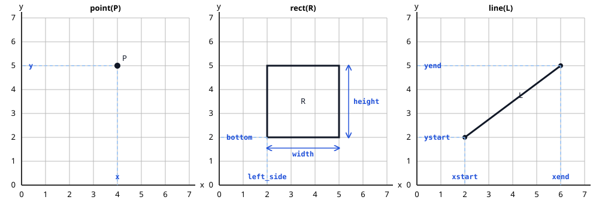

Flingdia is a declarative system for spatial reasoning. Its semantics are described in:

> Olivier, F., Diéguez, M., and Schultz, C. (2026). *Declarative Spatial
> Reasoning in Temporal Here-and-There with Constraints*. In ASPOCP 2026:
> 19th Workshop on Answer Set Programming and Other Computing Paradigms,
> FLoC 2026, Lisbon, Portugal.
{: .paper-citation}

This documentation gives a brief overview of the language and its encodings.

## Geometric sorts

Flingdia programs use the standard clingo language extended with spatial atoms.
Before using a spatial atom, declare each geometric object with one of the
ordinary ASP predicates `point/1`, `rect/1`, or `line/1`. 
Declaring a sort determines the parameters available to an object.

```clingo
point(a).
point(b).
rect(c).
```

Traditional pooling methods, like `point(a;b).`, can be used to facilitate the declaration.
Each geometric sort corresponds to parameters as follows:



The geometric constraints appying on geometric sorts are encoded into validity axioms (See [axioms](axioms.md)).

## Spatial relations

Spatial relations are theory atoms of the form `&relation(arguments)`. For
example, the following declaration places `a` to the left of `b`:

```clingo
&left(a,b).
```

Relation names are overloaded: the types of their arguments determine their
meaning. Thus, `&left(a,c)` is, for instance, also working for point `a` and rectangle `c`. 
The geometric meaning of each relation is described in the relation file of its type. 
Check the meaning of `&left(a,b)` in the [point-point](schemas/rels/point_point.md) relation page.


## Temporal operators

Temporal operators are theory atoms that locate a formula in time. The
horizon is `0` by default (a static scene) and is set with `-c n=…`. For
example, the following places `a` on the table in the initial state:

```clingo
&on(a,table) :- &initial.
```

The operators `&true`, `&initial`, `&next`, `&prev`, `&eventually`,
`&always`, `&until`, and `&not` are defined on the [semantics page](semantics.md).


## Running Flingdia
Install `metasp` and `matplotlib` (`pip install metasp matplotlib`). Matplotlib is required for the default diagram printer.

Run Flingdia from this directory. For example:

```bash
metasp solve flingo --meta-config config.yaml \
    --warn=no-atom-undefined \
    --project=show \
    instances/TEMP/blocks_world.lp  0 \
    -c display_time=7  \
    -c n=5 
```

The arguments mean:

- The input file is followed by the number of models to compute (`0` means all).
- `-c n=5` sets the temporal horizon.
- `--project=show` projects solutions onto the displayed atoms.
- `-c display_time=7` keeps diagrams open for 7 seconds.
- By default, Flingdia displays diagrams of the solutions. Add
  `--printer table_printer` to print only numeric tables, or `--printer none`
  to use the bare model output.

Each example file under `instances/` begins with a block comment containing
its complete launch command, which can be copied and run from this directory.

!!! note "Default axioms: definedness and inertia"

    By default, Flingdia assigns values to every parameter of every declared
    object in the initial state. Parameter values then persist through time by
    inertia unless a rule or action supports a change.

    Add the following facts to an input program to disable either default:

    ```clingo
    &partial.       % Allow parameters to remain undefined.
    &not_inertia.   % Disable persistence of parameter values.
    ```

    The directives are independent, so an input program may use either one or
    both. See the [axioms page](axioms.md) for the complete encoding.


This documentation is generated with [Clindocs](https://potassco.org/clindocs/)
directly from the comments in the Flingdia encodings.
